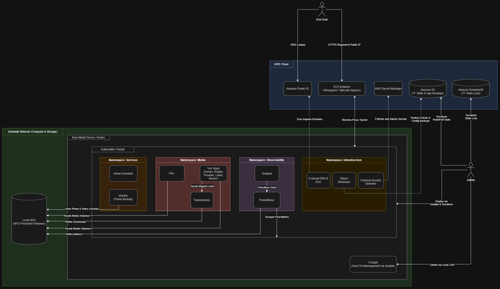

# HomeLab
Infrastructure and Documentation for my HomeLab setup

# HomeLab Overview

This repository contains the Infrastructure as Code (IaC), configuration management, and deployment manifests for a production-like hybrid cloud homelab. The goal of this project is to apply enterprise-grade DevOps practices—such as state management, secret injection, automated DNS, and GitOps—to a virtualized on-premises environment.

By utilizing a Hybrid Cloud Architecture, heavy compute and storage workloads run locally on Proxmox VMs to avoid cloud egress and compute fees, while control plane, state, and security components are offloaded to AWS to ensure high availability and security.

## Tech Stack
| Domain | Tools Used | Purpose |
|--------|------------|---------|
| Cloud Provider | AWS (S3, DynamoDB, Route53, Secrets Manager, EC2) | State, Secrets, DNS, and Ingress routing. |
| Hypervisor | Proxmox VE | Type-1 hypervisor for VM management and resource allocation. |
| Infrastructure as Code | Terraform | Provisioning the AWS cloud foundation. |
| Configuration Management | Ansible | Bootstrapping Ubuntu VMs, OS hardening, and installing K8s prerequisites. |
| Container Orchestration | Kubernetes (on Proxmox VMs) | Workload scheduling and application lifecycle management. |
| Deployment & Templating | Helm | Packaging and deploying Kubernetes manifests. |
| Observability | Prometheus, Grafana | Cluster and application metrics scraping and visualization. |
| Core Workloads | *Arr Stack, Plex, Immich, Home Assistant | Media streaming, photo backup, and home automation. |

## High-Level Architecture
The infrastructure is split into two distinct tiers:
1. AWS Cloud (Security, State & Ingress):
    - Manages remote Terraform state and locking.
    - Centralizes secrets management, eliminating hardcoded credentials in the cluster.
    - Handles DNS zones and records.
    - Provides a secure, reverse-proxied ingress tunnel to the local network without port-forwarding the home router.

2. Local On-Premises (Compute & Storage):
    - 2-node Proxmox VE cluster running on physical hardware.
    - Ubuntu VMs provisioned across Proxmox nodes hosting a Kubernetes cluster.
    - Integrates with a local NAS via persistent volume claims (NFS/iSCSI) for terabytes of media storage.
    - Synchronizes dynamically with AWS for external DNS and secrets.

## Deployment Phases
To recreate this environment from scratch, the infrastructure must be deployed in the following order:

### 1. Cloud Foundation (Terraform)
Provision the AWS infrastructure required to support the HomeLab environment.

**Key Tasks**:
- Provision the S3 bucket and DynamoDB table for Terraform remote state
- Create Route 53 hosted zones
- Provision AWS Secrets Manager entries
- Spin up the EC2 ingress tunnel node

 [Detailed deployment steps →](terraform/README.md)

---

### 2. VM Provisioning (Ansible)
Prepare the Ubuntu VMs running on Proxmox to host the Kubernetes cluster.

**Key Tasks**:
- Provision Ubuntu VMs on Proxmox hypervisor
- Update and harden Ubuntu VM nodes
- Configure networking, disable swap, and install container runtimes (containerd)
- Initialize the Kubernetes control plane and join worker nodes

 [Detailed deployment steps →](ansible/README.md)

---

### 3. Cluster Bootstrapping (Kubernetes/Helm)
Deploy foundational cluster services for networking, DNS, secrets, and ingress.

**Key Tasks**:
- Deploy the Container Network Interface (CNI - e.g., Calico/Cilium)
- Deploy external-dns to sync K8s ingresses with AWS Route 53
- Deploy external-secrets-operator (ESO) to sync AWS Secrets Manager to K8s native secrets
- Connect the cluster to the AWS EC2 ingress tunnel (Wireguard/Tailscale)

 [Detailed deployment steps →](kubernetes/README.md)

---

### 4. Application Deployment (Terraform + Helm)
Deploy application workloads using Terraform to manage Helm releases from public chart repositories.

**Applications**:
- **Observability**: kube-prometheus-stack (Grafana/Prometheus)
- **Media & Downloads**: Plex, Sonarr, Radarr, Prowlarr, Lidarr, Bazarr, Transmission
- **Services**: Home Assistant, Immich

 [Detailed deployment steps →](helm/README.md)